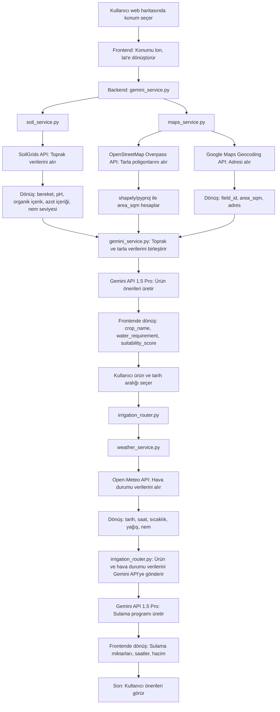

# Sürdürülebilir Tarım Platformu

Türkiye’de su kıtlığına karşı tarımda su israfını azaltmak, CO2 emisyonlarını düşürmek ve mahsul verimini artırmak için yapay zeka ve coğrafi API’ler kullanarak ürün seçimi ve sulama optimizasyonu yapan bir web uygulaması. Platform, tarımın neden olduğu su kıtlığının yaklaşık %70’ini ele alarak ekonomik büyümeye katkıda bulunur.

## Özellikler
- **Ürün Önerileri**: SoilGrids API’sinden alınan toprak verilerine ve tarla konumuna dayalı olarak Gemini 1.5 Pro tarafından desteklenen en uygun ürünleri önerir.
- **Tarla Alanı Hesaplama**: OpenStreetMap (Overpass API) ve Google Maps Geocoding API kullanarak tarla alanını belirler.
- **Sulama Optimizasyonu**: Open-Meteo API ile hava durumu tahminlerini ve Gemini 1.5 Pro ile yapay zeka analizini kullanarak hassas sulama programları sağlar.
- **Sürdürülebilirlik**: Su ve enerji kullanımını azaltarak Türkiye’deki çevresel ve ekonomik zorlukları ele alır.

## Proje Yapısı
```
Sustainability/
├── .env                    # Çevresel değişkenler (API anahtarları)
├── requirements.txt        # Python bağımlılıkları
└── app/
    ├── config.py           # pydantic-settings ile .env dosyasını yükler
    ├── __init__.py         # app/ dizinini Python paketi olarak işaretler
    ├── main.py             # FastAPI uygulamasının giriş noktası
    ├── models.py           # Veri modelleri (ör. Pydantic şemaları)
    ├── routers/            # API uç noktaları
    │   ├── field_router.py     # Tarla ile ilgili talepleri işler
    │   ├── __init__.py         # routers/ dizinini paket olarak işaretler
    │   ├── irrigation_router.py # Sulama programı taleplerini işler
    └── services/           # API entegrasyonları ve mantık
        ├── gemini_service.py   # Toprak, tarla ve ürün önerisi mantığını koordine eder
        ├── maps_service.py     # Tarla alanını hesaplar (OpenStreetMap, Google Maps)
        ├── soil_service.py     # Toprak verilerini alır (SoilGrids API)
        ├── weather_service.py  # Hava durumu tahminlerini alır (Open-Meteo API)
        ├── test_maps_service.py # maps_service.py’yi test eder
        ├── test_soil_service.py # soil_service.py’yi test eder
        ├── __init__.py         # services/ dizinini paket olarak işaretler
        └── __pycache__/        # Derlenmiş Python dosyaları
```

## Teknolojiler
- **Backend**: Python, FastAPI
- **API’ler**:
  - SoilGrids (toprak verileri)
  - OpenStreetMap Overpass API (tarla poligonları)
  - Google Maps Geocoding API (adres formatlama)
  - Open-Meteo API (hava durumu tahminleri)
  - Gemini 1.5 Pro (ürün önerileri, sulama optimizasyonu)
- **Kütüphaneler**: `aiohttp`, `shapely`, `pyproj`, `fastapi`, `pydantic`, `python-dotenv`, `googlegenerativeai`
- **Veritabanı**: SQLite (varsayılan, config.py ile yapılandırılabilir)

## Kurulum
1. **Depoyu Klonlayın**:
   ```bash
   git clone https://github.com/username/Sustainability
   cd Sustainability
   ```
2. **Sanal Ortam Oluşturun**:
   ```bash
   python3 -m venv venv
   source venv/bin/activate
   ```
3. **Bağımlılıkları Yükleyin**:
   ```bash
   pip install -r requirements.txt
   ```
4. **Çevresel Değişkenleri Yapılandırın**:
   - Kök dizinde bir `.env` dosyası oluşturun:
     ```bash
     touch .env
     ```
   - Aşağıdakileri ekleyin (API anahtarlarınızı ekleyin):
     ```
     GOOGLE_MAPS_API_KEY=your_google_maps_key
     GEMINI_API_KEY=your_gemini_key
     DATABASE_URL=sqlite:///./agriculture.db
     ```
   - Not: Open-Meteo ve SoilGrids API’leri anahtar gerektirmez. `OPENWEATHER_API_KEY` eğer `weather_service.py` Open-Meteo kullanıyorsa kullanılmayabilir.
5. **Uygulamayı Çalıştırın**:
   ```bash
   python3 app/main.py
   ```
   - API’ye varsayılan FastAPI portu üzerinden erişin: `http://localhost:8000`

## Kullanım
1. **Konum Seçimi**:
   - Web arayüzünde bir tarla konumu seçin; bu, enlem ve boylam (`lon`, `lat`) olarak dönüştürülür.
2. **Ürün Önerileri Alın**:
   - Uygulama, toprak verilerini (`soil_service.py`) ve tarla alanını (`maps_service.py`) alır.
   - `gemini_service.py`, Gemini 1.5 Pro kullanarak ürünleri önerir:
     - `crop_name`
     - `water_requirement_liters_per_sqm`
     - `suitability_score`
3. **Sulama Planlaması**:
   - `irrigation_router.py` üzerinden bir ürün ve tarih aralığı seçin.
   - `weather_service.py`, hava durumu verilerini (sıcaklık, yağış, nem) sağlar.
   - Gemini 1.5 Pro, optimal sulama programı (saatler, su miktarı) oluşturur.

## İş Akışı
Aşağıdaki Mermaid diyagramı, sistemin veri akışını ve API etkileşimlerini gösterir:



## API Entegrasyonları
- **SoilGrids**: Ürün uygunluğu için toprak özelliklerini (bereket, pH, vb.) sağlar.
- **OpenStreetMap (Overpass API)**: Tarla alanını hesaplamak için poligonları alır; veri yoksa 100m yarıçap tahmini kullanır.
- **Google Maps Geocoding**: `lon`, `lat`’ı okunabilir bir adrese dönüştürür.
- **Open-Meteo**: Günlük 3 saatlik hava durumu tahminleri (sıcaklık, yağış, nem) sunar.
- **Gemini 1.5 Pro**: Toprak, tarla ve hava durumu verilerini analiz ederek ürün önerir ve sulamayı optimize eder.

## Katkıda Bulunma
1. Repoyu forklayın.
2. Özellik branci oluşturun: `git checkout -b özellik-ismi`.
3. Değişiklikleri kaydedin: `git commit -m "Özellik eklendi"`.
4. Branchi pushlayın: `git push origin özellik-ismi`.
5. Bir pull request açın.

## Lisans
[MIT Lisansı](LICENSE).

## İletişim
- **Developer**: Nevroz Aslan
- **E-posta**: as.nevroz@gmail.com

## Teşekkürler
- Türkiye’nin su kıtlığı krizini çözme ilhamıyla geliştirildi.
- SoilGrids, OpenStreetMap, Open-Meteo ve Gemini AI gibi açık kaynaklı API’lere teşekkürler.
